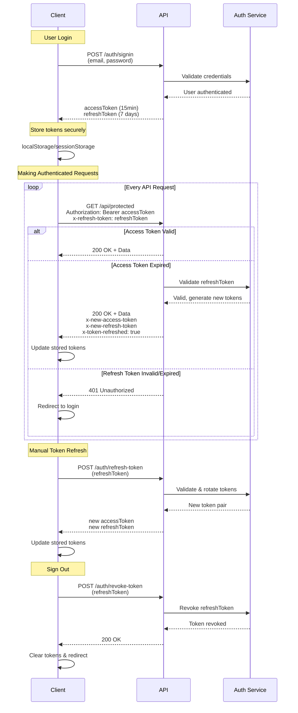

# Authentication API

The Authentication API provides secure user authentication, email verification, password management, and token handling for your applications.

<Note>
All endpoints use the base URL: `https://jethings-backend.fly.dev` (production) or `http://localhost:3000` (development)
</Note>

## 🔐 Authentication Flow

<Steps>
  <Step title="Sign Up">
    Create account with email verification
  </Step>
  <Step title="Verify Email">
    Enter OTP sent to email
  </Step>
  <Step title="Sign In">
    Get access and refresh tokens
  </Step>
  <Step title="Make Requests">
    Use access token in Authorization header
  </Step>
  <Step title="Refresh Token">
    Get new tokens when access token expires
  </Step>
</Steps>

## 📝 User Registration

### Sign Up

Create a new user account with email verification.

<CodeGroup>
```bash cURL
curl -X POST https://jethings-backend.fly.dev/auth/signup \
  -H "Content-Type: application/json" \
  -d '{
    "firstName": "Jane",
    "lastName": "Doe",
    "email": "jane@example.com",
    "phoneNumber": "+1234567890",
    "password": "strongPass123",
    "age": 28,
    "description": "Software developer"
  }'
```

```typescript TypeScript
const response = await fetch('https://jethings-backend.fly.dev/auth/signup', {
  method: 'POST',
  headers: { 'Content-Type': 'application/json' },
  body: JSON.stringify({
    firstName: 'Jane',
    lastName: 'Doe',
    email: 'jane@example.com',
    phoneNumber: '+1234567890',
    password: 'strongPass123',
    age: 28,
    description: 'Software developer'
  })
});

const result = await response.json();
```

```dart Flutter
final response = await http.post(
  Uri.parse('https://jethings-backend.fly.dev/auth/signup'),
  headers: {'Content-Type': 'application/json'},
  body: jsonEncode({
    'firstName': 'Jane',
    'lastName': 'Doe',
    'email': 'jane@example.com',
    'phoneNumber': '+1234567890',
    'password': 'strongPass123',
    'age': 28,
    'description': 'Software developer'
  }),
);
```
</CodeGroup>

**Request Body:**

| Field | Type | Required | Description |
|-------|------|----------|-------------|
| `firstName` | string | ✅ | User's first name |
| `lastName` | string | ✅ | User's last name |
| `email` | string | ✅ | Valid email address (must be unique) |
| `phoneNumber` | string | ✅ | Valid phone number (must be unique) |
| `password` | string | ✅ | Minimum 6 characters |
| `age` | number | ✅ | Integer between 1-120 |
| `description` | string | ❌ | Optional user bio |

**Success Response (200):**
```json
{
  "message": "User created, check your email for verification code"
}
```

**Error Responses:**
- `409 Conflict`: Email already exists
- `409 Conflict`: Phone number already exists
- `400 Bad Request`: Validation errors

---

### Verify Email

Verify user email with the OTP sent during signup.

<CodeGroup>
```bash cURL
curl -X POST https://jethings-backend.fly.dev/auth/verify-email \
  -H "Content-Type: application/json" \
  -d '{"otp": "123456"}'
```

```typescript TypeScript
const response = await fetch('https://jethings-backend.fly.dev/auth/verify-email', {
  method: 'POST',
  headers: { 'Content-Type': 'application/json' },
  body: JSON.stringify({ otp: '123456' })
});

const result = await response.json();
```

```dart Flutter
final response = await http.post(
  Uri.parse('https://jethings-backend.fly.dev/auth/verify-email'),
  headers: {'Content-Type': 'application/json'},
  body: jsonEncode({'otp': '123456'}),
);
```
</CodeGroup>

**Request Body:**

| Field | Type | Required | Description |
|-------|------|----------|-------------|
| `otp` | string | ✅ | 6-digit verification code |

**Success Response (200):**
```json
{
  "message": "Email verified successfully"
}
```

**Error Responses:**
- `400 Bad Request`: Invalid or expired OTP
- `400 Bad Request`: Too many attempts (max 3)

<Note>
- OTP expires after 10 minutes
- Maximum 3 attempts per OTP
- OTP is automatically deleted after successful verification
</Note>

---

## 🔑 User Authentication

### Sign In

Authenticate user and receive access/refresh tokens.

<CodeGroup>
```bash cURL
curl -X POST https://jethings-backend.fly.dev/auth/signin \
  -H "Content-Type: application/json" \
  -d '{
    "email": "jane@example.com",
    "password": "strongPass123"
  }'
```

```typescript TypeScript
const response = await fetch('https://jethings-backend.fly.dev/auth/signin', {
  method: 'POST',
  headers: { 'Content-Type': 'application/json' },
  body: JSON.stringify({
    email: 'jane@example.com',
    password: 'strongPass123'
  })
});

const result = await response.json();
// Store tokens securely
localStorage.setItem('refreshToken', result.refreshToken);
```

```dart Flutter
final response = await http.post(
  Uri.parse('https://jethings-backend.fly.dev/auth/signin'),
  headers: {'Content-Type': 'application/json'},
  body: jsonEncode({
    'email': 'jane@example.com',
    'password': 'strongPass123'
  }),
);

final result = jsonDecode(response.body);
// Store tokens securely
await storage.write(key: 'refreshToken', value: result['refreshToken']);
```
</CodeGroup>

**Request Body:**

| Field | Type | Required | Description |
|-------|------|----------|-------------|
| `email` | string | ✅ | User's email address |
| `password` | string | ✅ | User's password |

**Success Response (200):**
```json
{
  "message": "Signed in successfully",
  "user": {
    "id": "ck_123...",
    "email": "jane@example.com",
    "firstName": "Jane",
    "lastName": "Doe",
    "roles": ["user"]
  },
  "accessToken": "eyJhbGciOiJIUzI1NiIsInR5cCI6IkpXVCJ9...",
  "refreshToken": "a1b2c3d4e5f6g7h8i9j0k1l2m3n4o5p6q7r8s9t0",
  "expiresIn": 900
}
```

**Error Responses:**
- `401 Unauthorized`: Invalid credentials
- `401 Unauthorized`: Email not verified

<Note>
- Access token expires in 15 minutes
- Refresh token expires in 7 days
- Store refresh token securely (httpOnly cookie recommended)
</Note>

---

### Get Current User

Retrieve current authenticated user's profile.

<CodeGroup>
```bash cURL
curl -X GET https://jethings-backend.fly.dev/auth/me \
  -H "Authorization: Bearer YOUR_ACCESS_TOKEN"
```

```typescript TypeScript
const response = await fetch('https://jethings-backend.fly.dev/auth/me', {
  headers: {
    'Authorization': `Bearer ${accessToken}`,
    'Content-Type': 'application/json'
  }
});

const user = await response.json();
```

```dart Flutter
final response = await http.get(
  Uri.parse('https://jethings-backend.fly.dev/auth/me'),
  headers: {
    'Authorization': 'Bearer $accessToken',
    'Content-Type': 'application/json'
  },
);
```
</CodeGroup>

**Success Response (200):**
```json
{
  "id": "ck_123...",
  "email": "jane@example.com",
  "firstName": "Jane",
  "lastName": "Doe",
  "age": 28,
  "phoneNumber": "+1234567890",
  "avatarUrl": "https://example.com/avatar.jpg",
  "description": "Software developer",
  "roles": ["user"],
  "isEmailVerified": true,
  "lastActivity": "2024-01-15T10:30:00.000Z",
  "createdAt": "2024-01-01T00:00:00.000Z",
  "updatedAt": "2024-01-15T10:30:00.000Z"
}
```

**Error Responses:**
- `401 Unauthorized`: Invalid or expired token
- `401 Unauthorized`: User not found
- `401 Unauthorized`: Account deactivated

---

## 🔄 Refresh Token Flow

### Overview

Jethings Backend implements a secure refresh token authentication system that provides persistent, secure user sessions without compromising security.

**Token Types:**
- **Access Token**: Short-lived JWT (15 minutes) used to authenticate API requests
- **Refresh Token**: Long-lived token (7 days) used to obtain new access tokens

**Key Features:**
- Automatic token refresh via backend middleware
- Manual token refresh option
- Token rotation on each refresh
- Secure token revocation

### Authentication Flow Diagram



### Storing Tokens

Store tokens securely on the client. Common approaches:

**Web Applications:**
- `localStorage` - Persists across browser sessions
- `sessionStorage` - Persists only for current session
- `httpOnly` cookies (recommended for refresh tokens)
- React Context/State Management

**Mobile Applications:**
- Secure storage (Keychain on iOS, Keystore on Android)
- Encrypted shared preferences

**Example: Storing tokens after login**

<CodeGroup>
```typescript TypeScript
const loginResponse = await fetch('https://jethings-backend.fly.dev/auth/signin', {
  method: 'POST',
  headers: { 'Content-Type': 'application/json' },
  body: JSON.stringify({ email, password }),
});

const data = await loginResponse.json();

// Store tokens securely
localStorage.setItem('accessToken', data.accessToken);
localStorage.setItem('refreshToken', data.refreshToken);
localStorage.setItem('tokenExpiresAt', Date.now() + (data.expiresIn * 1000));
```

```javascript JavaScript
const loginResponse = await fetch('https://jethings-backend.fly.dev/auth/signin', {
  method: 'POST',
  headers: { 'Content-Type': 'application/json' },
  body: JSON.stringify({ email, password }),
});

const data = await loginResponse.json();

// Store tokens securely
localStorage.setItem('accessToken', data.accessToken);
localStorage.setItem('refreshToken', data.refreshToken);
localStorage.setItem('tokenExpiresAt', Date.now() + (data.expiresIn * 1000));
```
</CodeGroup>

### Option 1: Automatic Token Refresh (Recommended)

The backend middleware automatically refreshes expired access tokens when both tokens are included in the request headers. This is the simplest and recommended approach.

**How it works:**
1. Include both `Authorization: Bearer <accessToken>` and `x-refresh-token: <refreshToken>` headers
2. If the access token is expired, the backend automatically refreshes it
3. New tokens are returned in response headers
4. Update your stored tokens with the new values

**Implementation Example:**

<CodeGroup>
```typescript TypeScript
async function makeAuthenticatedRequest(url: string, options: RequestInit = {}) {
  const accessToken = localStorage.getItem('accessToken');
  const refreshToken = localStorage.getItem('refreshToken');

  const response = await fetch(url, {
    ...options,
    headers: {
      ...options.headers,
      'Authorization': `Bearer ${accessToken}`,
      'x-refresh-token': refreshToken || '',
      'Content-Type': 'application/json',
    },
  });

  // Check if tokens were refreshed
  const newAccessToken = response.headers.get('x-new-access-token');
  const newRefreshToken = response.headers.get('x-new-refresh-token');
  const tokenRefreshed = response.headers.get('x-token-refreshed');

  if (tokenRefreshed === 'true' && newAccessToken && newRefreshToken) {
    // Update stored tokens
    localStorage.setItem('accessToken', newAccessToken);
    localStorage.setItem('refreshToken', newRefreshToken);
    
    // Update expires time if provided
    const expiresIn = response.headers.get('x-token-expires-in');
    if (expiresIn) {
      localStorage.setItem('tokenExpiresAt', Date.now() + (parseInt(expiresIn) * 1000));
    }
  }

  return response;
}

// Usage
const data = await makeAuthenticatedRequest('https://jethings-backend.fly.dev/api/protected-endpoint', {
  method: 'GET',
});
```

```javascript JavaScript
async function makeAuthenticatedRequest(url, options = {}) {
  const accessToken = localStorage.getItem('accessToken');
  const refreshToken = localStorage.getItem('refreshToken');

  const response = await fetch(url, {
    ...options,
    headers: {
      ...options.headers,
      'Authorization': `Bearer ${accessToken}`,
      'x-refresh-token': refreshToken || '',
      'Content-Type': 'application/json',
    },
  });

  // Check if tokens were refreshed
  const newAccessToken = response.headers.get('x-new-access-token');
  const newRefreshToken = response.headers.get('x-new-refresh-token');
  const tokenRefreshed = response.headers.get('x-token-refreshed');

  if (tokenRefreshed === 'true' && newAccessToken && newRefreshToken) {
    // Update stored tokens
    localStorage.setItem('accessToken', newAccessToken);
    localStorage.setItem('refreshToken', newRefreshToken);
    
    // Update expires time if provided
    const expiresIn = response.headers.get('x-token-expires-in');
    if (expiresIn) {
      localStorage.setItem('tokenExpiresAt', Date.now() + (parseInt(expiresIn) * 1000));
    }
  }

  return response;
}

// Usage
const data = await makeAuthenticatedRequest('https://jethings-backend.fly.dev/api/protected-endpoint', {
  method: 'GET',
});
```
</CodeGroup>

**Response Headers (Automatic Refresh):**

When automatic token refresh occurs, the backend responds with:

| Header | Description |
|--------|-------------|
| `x-new-access-token` | New access token (if refreshed) |
| `x-new-refresh-token` | New refresh token (if refreshed) |
| `x-token-refreshed` | `"true"` if tokens were refreshed |
| `x-token-expires-in` | Token expiration time in seconds |

### Option 2: Manual Token Refresh

Implement your own refresh logic before making requests. This gives you more control over when tokens are refreshed.

**Implementation Example:**

<CodeGroup>
```typescript TypeScript
async function ensureValidToken(): Promise<string> {
  const accessToken = localStorage.getItem('accessToken');
  const refreshToken = localStorage.getItem('refreshToken');
  const expiresAt = localStorage.getItem('tokenExpiresAt');

  // Check if token is expired or about to expire (within 1 minute)
  if (!accessToken || !expiresAt || Date.now() >= parseInt(expiresAt) - 60000) {
    if (!refreshToken) {
      // Redirect to login
      window.location.href = '/login';
      throw new Error('No valid tokens');
    }

    // Refresh the token
    const response = await fetch('https://jethings-backend.fly.dev/auth/refresh-token', {
      method: 'POST',
      headers: { 'Content-Type': 'application/json' },
      body: JSON.stringify({ refreshToken }),
    });

    if (!response.ok) {
      // Refresh token is invalid, redirect to login
      localStorage.removeItem('accessToken');
      localStorage.removeItem('refreshToken');
      localStorage.removeItem('tokenExpiresAt');
      window.location.href = '/login';
      throw new Error('Token refresh failed');
    }

    const data = await response.json();
    
    // Update stored tokens
    localStorage.setItem('accessToken', data.accessToken);
    localStorage.setItem('refreshToken', data.refreshToken);
    localStorage.setItem('tokenExpiresAt', Date.now() + (data.expiresIn * 1000));

    return data.accessToken;
  }

  return accessToken;
}

async function makeAuthenticatedRequest(url: string, options: RequestInit = {}) {
  const accessToken = await ensureValidToken();

  return fetch(url, {
    ...options,
    headers: {
      ...options.headers,
      'Authorization': `Bearer ${accessToken}`,
      'Content-Type': 'application/json',
    },
  });
}
```

```javascript JavaScript
async function ensureValidToken() {
  const accessToken = localStorage.getItem('accessToken');
  const refreshToken = localStorage.getItem('refreshToken');
  const expiresAt = localStorage.getItem('tokenExpiresAt');

  // Check if token is expired or about to expire (within 1 minute)
  if (!accessToken || !expiresAt || Date.now() >= parseInt(expiresAt) - 60000) {
    if (!refreshToken) {
      // Redirect to login
      window.location.href = '/login';
      throw new Error('No valid tokens');
    }

    // Refresh the token
    const response = await fetch('https://jethings-backend.fly.dev/auth/refresh-token', {
      method: 'POST',
      headers: { 'Content-Type': 'application/json' },
      body: JSON.stringify({ refreshToken }),
    });

    if (!response.ok) {
      // Refresh token is invalid, redirect to login
      localStorage.removeItem('accessToken');
      localStorage.removeItem('refreshToken');
      localStorage.removeItem('tokenExpiresAt');
      window.location.href = '/login';
      throw new Error('Token refresh failed');
    }

    const data = await response.json();
    
    // Update stored tokens
    localStorage.setItem('accessToken', data.accessToken);
    localStorage.setItem('refreshToken', data.refreshToken);
    localStorage.setItem('tokenExpiresAt', Date.now() + (data.expiresIn * 1000));

    return data.accessToken;
  }

  return accessToken;
}

async function makeAuthenticatedRequest(url, options = {}) {
  const accessToken = await ensureValidToken();

  return fetch(url, {
    ...options,
    headers: {
      ...options.headers,
      'Authorization': `Bearer ${accessToken}`,
      'Content-Type': 'application/json',
    },
  });
}
```
</CodeGroup>

### React Hook Example

For React applications, here's a custom hook for managing authentication:

<CodeGroup>
```typescript React Hook
import { useState, useEffect, useCallback } from 'react';

function useAuth() {
  const [accessToken, setAccessToken] = useState<string | null>(
    localStorage.getItem('accessToken')
  );
  const [refreshToken, setRefreshToken] = useState<string | null>(
    localStorage.getItem('refreshToken')
  );

  const refreshTokens = useCallback(async () => {
    if (!refreshToken) return false;

    try {
      const response = await fetch('https://jethings-backend.fly.dev/auth/refresh-token', {
        method: 'POST',
        headers: { 'Content-Type': 'application/json' },
        body: JSON.stringify({ refreshToken }),
      });

      if (!response.ok) {
        // Clear tokens and redirect to login
        setAccessToken(null);
        setRefreshToken(null);
        localStorage.removeItem('accessToken');
        localStorage.removeItem('refreshToken');
        return false;
      }

      const data = await response.json();
      setAccessToken(data.accessToken);
      setRefreshToken(data.refreshToken);
      localStorage.setItem('accessToken', data.accessToken);
      localStorage.setItem('refreshToken', data.refreshToken);
      return true;
    } catch (error) {
      console.error('Token refresh failed:', error);
      return false;
    }
  }, [refreshToken]);

  const makeRequest = useCallback(async (url: string, options: RequestInit = {}) => {
    const response = await fetch(url, {
      ...options,
      headers: {
        ...options.headers,
        'Authorization': `Bearer ${accessToken}`,
        'x-refresh-token': refreshToken || '',
        'Content-Type': 'application/json',
      },
    });

    // Handle automatic token refresh
    const newAccessToken = response.headers.get('x-new-access-token');
    const newRefreshToken = response.headers.get('x-new-refresh-token');
    const tokenRefreshed = response.headers.get('x-token-refreshed');

    if (tokenRefreshed === 'true' && newAccessToken && newRefreshToken) {
      setAccessToken(newAccessToken);
      setRefreshToken(newRefreshToken);
      localStorage.setItem('accessToken', newAccessToken);
      localStorage.setItem('refreshToken', newRefreshToken);
    }

    return response;
  }, [accessToken, refreshToken]);

  return { accessToken, refreshToken, refreshTokens, makeRequest };
}
```
</CodeGroup>

### Axios Interceptor Example

For applications using Axios, you can use interceptors to handle token refresh automatically:

<CodeGroup>
```typescript Axios
import axios from 'axios';

// Create axios instance
const apiClient = axios.create({
  baseURL: 'https://jethings-backend.fly.dev',
});

// Request interceptor to add tokens
apiClient.interceptors.request.use(
  (config) => {
    const accessToken = localStorage.getItem('accessToken');
    const refreshToken = localStorage.getItem('refreshToken');

    if (accessToken) {
      config.headers.Authorization = `Bearer ${accessToken}`;
    }
    if (refreshToken) {
      config.headers['x-refresh-token'] = refreshToken;
    }

    return config;
  },
  (error) => Promise.reject(error)
);

// Response interceptor to handle token refresh
apiClient.interceptors.response.use(
  (response) => {
    const newAccessToken = response.headers['x-new-access-token'];
    const newRefreshToken = response.headers['x-new-refresh-token'];
    const tokenRefreshed = response.headers['x-token-refreshed'];

    if (tokenRefreshed === 'true' && newAccessToken && newRefreshToken) {
      localStorage.setItem('accessToken', newAccessToken);
      localStorage.setItem('refreshToken', newRefreshToken);
    }

    return response;
  },
  async (error) => {
    const originalRequest = error.config;

    // If 401 and we haven't already tried to refresh
    if (error.response?.status === 401 && !originalRequest._retry) {
      originalRequest._retry = true;

      const refreshToken = localStorage.getItem('refreshToken');
      if (!refreshToken) {
        // Redirect to login
        window.location.href = '/login';
        return Promise.reject(error);
      }

      try {
        const response = await axios.post('https://jethings-backend.fly.dev/auth/refresh-token', {
          refreshToken,
        });

        const { accessToken, refreshToken: newRefreshToken } = response.data;
        localStorage.setItem('accessToken', accessToken);
        localStorage.setItem('refreshToken', newRefreshToken);

        // Retry original request with new token
        originalRequest.headers.Authorization = `Bearer ${accessToken}`;
        return apiClient(originalRequest);
      } catch (refreshError) {
        // Refresh failed, redirect to login
        localStorage.removeItem('accessToken');
        localStorage.removeItem('refreshToken');
        window.location.href = '/login';
        return Promise.reject(refreshError);
      }
    }

    return Promise.reject(error);
  }
);
```
</CodeGroup>

### Sign Out / Token Revocation

Always revoke refresh tokens when the user signs out:

<CodeGroup>
```typescript TypeScript
async function signOut() {
  const refreshToken = localStorage.getItem('refreshToken');
  
  if (refreshToken) {
    try {
      await fetch('https://jethings-backend.fly.dev/auth/revoke-token', {
        method: 'POST',
        headers: {
          'Authorization': `Bearer ${localStorage.getItem('accessToken')}`,
          'Content-Type': 'application/json',
        },
        body: JSON.stringify({ refreshToken }),
      });
    } catch (error) {
      console.error('Error revoking token:', error);
    }
  }

  // Clear local storage
  localStorage.removeItem('accessToken');
  localStorage.removeItem('refreshToken');
  localStorage.removeItem('tokenExpiresAt');
  
  // Redirect to login
  window.location.href = '/login';
}
```

```javascript JavaScript
async function signOut() {
  const refreshToken = localStorage.getItem('refreshToken');
  
  if (refreshToken) {
    try {
      await fetch('https://jethings-backend.fly.dev/auth/revoke-token', {
        method: 'POST',
        headers: {
          'Authorization': `Bearer ${localStorage.getItem('accessToken')}`,
          'Content-Type': 'application/json',
        },
        body: JSON.stringify({ refreshToken }),
      });
    } catch (error) {
      console.error('Error revoking token:', error);
    }
  }

  // Clear local storage
  localStorage.removeItem('accessToken');
  localStorage.removeItem('refreshToken');
  localStorage.removeItem('tokenExpiresAt');
  
  // Redirect to login
  window.location.href = '/login';
}
```
</CodeGroup>

### Security Best Practices

<Tip>
**Important Security Considerations:**
</Tip>

- ✅ **Never expose refresh tokens** in URLs, client-side logs, or error messages
- ✅ **Use HTTPS** in production to protect tokens in transit
- ✅ **Consider httpOnly cookies** for refresh tokens in web applications
- ✅ **Implement token rotation** - always use new refresh tokens when received
- ✅ **Handle token expiration gracefully** - redirect to login when refresh fails
- ✅ **Store tokens securely** - use secure storage mechanisms appropriate for your platform
- ✅ **Revoke tokens on logout** - always call the revoke endpoint when users sign out
- ✅ **Clear tokens on errors** - remove stored tokens if refresh fails

---

## 🔄 Token Management

### Refresh Token

Get new access and refresh tokens when the current access token expires.

<CodeGroup>
```bash cURL
curl -X POST https://jethings-backend.fly.dev/auth/refresh-token \
  -H "Content-Type: application/json" \
  -d '{"refreshToken": "a1b2c3d4e5f6g7h8i9j0k1l2m3n4o5p6q7r8s9t0"}'
```

```typescript TypeScript
const response = await fetch('https://jethings-backend.fly.dev/auth/refresh-token', {
  method: 'POST',
  headers: { 'Content-Type': 'application/json' },
  body: JSON.stringify({ refreshToken: storedRefreshToken })
});

const newTokens = await response.json();
// Update stored tokens
localStorage.setItem('refreshToken', newTokens.refreshToken);
```

```dart Flutter
final response = await http.post(
  Uri.parse('https://jethings-backend.fly.dev/auth/refresh-token'),
  headers: {'Content-Type': 'application/json'},
  body: jsonEncode({'refreshToken': refreshToken}),
);
```
</CodeGroup>

**Request Body:**

| Field | Type | Required | Description |
|-------|------|----------|-------------|
| `refreshToken` | string | ✅ | Valid refresh token |

**Success Response (200):**
```json
{
  "message": "Tokens refreshed successfully",
  "accessToken": "eyJhbGciOiJIUzI1NiIsInR5cCI6IkpXVCJ9...",
  "refreshToken": "b2c3d4e5f6g7h8i9j0k1l2m3n4o5p6q7r8s9t0u1",
  "expiresIn": 900
}
```

**Error Responses:**
- `401 Unauthorized`: Invalid or expired refresh token

---

### Revoke Token

Revoke a specific refresh token (logout from one device).

<CodeGroup>
```bash cURL
curl -X POST https://jethings-backend.fly.dev/auth/revoke-token \
  -H "Authorization: Bearer YOUR_ACCESS_TOKEN" \
  -H "Content-Type: application/json" \
  -d '{"refreshToken": "a1b2c3d4e5f6g7h8i9j0k1l2m3n4o5p6q7r8s9t0"}'
```

```typescript TypeScript
const response = await fetch('https://jethings-backend.fly.dev/auth/revoke-token', {
  method: 'POST',
  headers: {
    'Authorization': `Bearer ${accessToken}`,
    'Content-Type': 'application/json'
  },
  body: JSON.stringify({ refreshToken: specificRefreshToken })
});
```

```dart Flutter
final response = await http.post(
  Uri.parse('https://jethings-backend.fly.dev/auth/revoke-token'),
  headers: {
    'Authorization': 'Bearer $accessToken',
    'Content-Type': 'application/json'
  },
  body: jsonEncode({'refreshToken': refreshToken}),
);
```
</CodeGroup>

**Success Response (200):**
```json
{
  "message": "Refresh token revoked successfully"
}
```

---

### Revoke All Tokens

Revoke all refresh tokens for the current user (logout from all devices).

<CodeGroup>
```bash cURL
curl -X POST https://jethings-backend.fly.dev/auth/revoke-all-tokens \
  -H "Authorization: Bearer YOUR_ACCESS_TOKEN"
```

```typescript TypeScript
const response = await fetch('https://jethings-backend.fly.dev/auth/revoke-all-tokens', {
  method: 'POST',
  headers: {
    'Authorization': `Bearer ${accessToken}`,
    'Content-Type': 'application/json'
  }
});
```

```dart Flutter
final response = await http.post(
  Uri.parse('https://jethings-backend.fly.dev/auth/revoke-all-tokens'),
  headers: {
    'Authorization': 'Bearer $accessToken',
    'Content-Type': 'application/json'
  },
);
```
</CodeGroup>

**Success Response (200):**
```json
{
  "message": "All refresh tokens revoked successfully"
}
```

---

### Logout

Alias for revoke-all-tokens (logout from all devices).

<CodeGroup>
```bash cURL
curl -X POST https://jethings-backend.fly.dev/auth/logout \
  -H "Authorization: Bearer YOUR_ACCESS_TOKEN"
```

```typescript TypeScript
const response = await fetch('https://jethings-backend.fly.dev/auth/logout', {
  method: 'POST',
  headers: {
    'Authorization': `Bearer ${accessToken}`,
    'Content-Type': 'application/json'
  }
});
```

```dart Flutter
final response = await http.post(
  Uri.parse('https://jethings-backend.fly.dev/auth/logout'),
  headers: {
    'Authorization': 'Bearer $accessToken',
    'Content-Type': 'application/json'
  },
);
```
</CodeGroup>

**Success Response (200):**
```json
{
  "message": "All refresh tokens revoked successfully"
}
```

---

## 🔒 Password Management

### Request Password Reset

Request a password reset OTP to be sent to user's email.

<CodeGroup>
```bash cURL
curl -X POST https://jethings-backend.fly.dev/auth/request-password-reset \
  -H "Content-Type: application/json" \
  -d '{"email": "jane@example.com"}'
```

```typescript TypeScript
const response = await fetch('https://jethings-backend.fly.dev/auth/request-password-reset', {
  method: 'POST',
  headers: { 'Content-Type': 'application/json' },
  body: JSON.stringify({ email: 'jane@example.com' })
});

const result = await response.json();
```

```dart Flutter
final response = await http.post(
  Uri.parse('https://jethings-backend.fly.dev/auth/request-password-reset'),
  headers: {'Content-Type': 'application/json'},
  body: jsonEncode({'email': 'jane@example.com'}),
);
```
</CodeGroup>

**Request Body:**

| Field | Type | Required | Description |
|-------|------|----------|-------------|
| `email` | string | ✅ | User's email address |

**Success Response (200):**
```json
{
  "message": "If that email exists, a reset code was sent"
}
```

<Note>
Always returns this message to prevent email enumeration attacks.
</Note>

---

### Verify Password Reset

Reset password using the OTP sent to user's email.

<CodeGroup>
```bash cURL
curl -X POST https://jethings-backend.fly.dev/auth/verify-password-reset \
  -H "Content-Type: application/json" \
  -d '{
    "otp": "123456",
    "newPassword": "newStrongPass456"
  }'
```

```typescript TypeScript
const response = await fetch('https://jethings-backend.fly.dev/auth/verify-password-reset', {
  method: 'POST',
  headers: { 'Content-Type': 'application/json' },
  body: JSON.stringify({
    otp: '123456',
    newPassword: 'newStrongPass456'
  })
});

const result = await response.json();
```

```dart Flutter
final response = await http.post(
  Uri.parse('https://jethings-backend.fly.dev/auth/verify-password-reset'),
  headers: {'Content-Type': 'application/json'},
  body: jsonEncode({
    'otp': '123456',
    'newPassword': 'newStrongPass456'
  }),
);
```
</CodeGroup>

**Request Body:**

| Field | Type | Required | Description |
|-------|------|----------|-------------|
| `otp` | string | ✅ | 6-digit reset code |
| `newPassword` | string | ✅ | New password (min 6 characters) |

**Success Response (200):**
```json
{
  "message": "Password reset successful"
}
```

**Error Responses:**
- `400 Bad Request`: Invalid or expired OTP
- `400 Bad Request`: Too many attempts (max 3)

---

## 🛠️ Development Endpoints

### Create Super Admin (Development Only)

Create a super admin account for development purposes.

<Warning>
This endpoint is only available when `NODE_ENV=development`
</Warning>

<CodeGroup>
```bash cURL
curl -X POST https://jethings-backend.fly.dev/auth/dev/super-admin \
  -H "Content-Type: application/json" \
  -d '{
    "firstName": "Super",
    "lastName": "Admin",
    "email": "superadmin@example.com",
    "password": "superSecurePassword123",
    "phoneNumber": "+1234567890",
    "age": 35,
    "description": "Development super administrator"
  }'
```

```typescript TypeScript
const response = await fetch('https://jethings-backend.fly.dev/auth/dev/super-admin', {
  method: 'POST',
  headers: { 'Content-Type': 'application/json' },
  body: JSON.stringify({
    firstName: 'Super',
    lastName: 'Admin',
    email: 'superadmin@example.com',
    password: 'superSecurePassword123',
    phoneNumber: '+1234567890',
    age: 35,
    description: 'Development super administrator'
  })
});

const result = await response.json();
```

```dart Flutter
final response = await http.post(
  Uri.parse('https://jethings-backend.fly.dev/auth/dev/super-admin'),
  headers: {'Content-Type': 'application/json'},
  body: jsonEncode({
    'firstName': 'Super',
    'lastName': 'Admin',
    'email': 'superadmin@example.com',
    'password': 'superSecurePassword123',
    'phoneNumber': '+1234567890',
    'age': 35,
    'description': 'Development super administrator'
  }),
);
```
</CodeGroup>

**Request Body:**

| Field | Type | Required | Description |
|-------|------|----------|-------------|
| `firstName` | string | ✅ | Super admin's first name |
| `lastName` | string | ✅ | Super admin's last name |
| `email` | string | ✅ | Valid email address (must be unique) |
| `password` | string | ✅ | Minimum 6 characters |
| `phoneNumber` | string | ✅ | Valid phone number (must be unique) |
| `age` | number | ✅ | Integer between 1-120 |
| `description` | string | ❌ | Optional description |

**Success Response (200):**
```json
{
  "message": "Super admin created successfully (Development Only)",
  "admin": {
    "id": "ck_789...",
    "email": "superadmin@example.com",
    "firstName": "Super",
    "lastName": "Admin",
    "age": 35,
    "phoneNumber": "+1234567890",
    "avatarUrl": null,
    "description": "Development super administrator",
    "roles": ["super_admin"],
    "isEmailVerified": true,
    "isActive": true,
    "lastActivity": null,
    "createdAt": "2024-01-15T12:00:00.000Z",
    "updatedAt": "2024-01-15T12:00:00.000Z",
    "isAdmin": false,
    "isSuperAdmin": true
  }
}
```

**Error Responses:**
- `403 Forbidden`: Endpoint only available in development
- `409 Conflict`: Email already exists
- `409 Conflict`: Phone number already exists

---

## 🔧 Error Handling

### Common Error Codes

| Status Code | Description | Common Causes |
|-------------|-------------|---------------|
| `400 Bad Request` | Invalid request data | Validation errors, malformed JSON |
| `401 Unauthorized` | Authentication required | Missing/invalid token, expired token |
| `403 Forbidden` | Insufficient permissions | Wrong role, development-only endpoint |
| `404 Not Found` | Resource not found | Invalid endpoint, missing resource |
| `409 Conflict` | Resource conflict | Email/phone already exists |
| `500 Internal Server Error` | Server error | Database issues, unexpected errors |

### Error Response Format

```json
{
  "message": "Error description",
  "statusCode": 400
}
```

### Handling Errors in Your Code

<CodeGroup>
```typescript TypeScript
try {
  const response = await fetch('https://jethings-backend.fly.dev/auth/signin', {
    method: 'POST',
    headers: { 'Content-Type': 'application/json' },
    body: JSON.stringify({ email, password })
  });

  if (!response.ok) {
    const error = await response.json();
    throw new Error(error.message || 'Authentication failed');
  }

  const data = await response.json();
  // Handle success
} catch (error) {
  console.error('Auth error:', error.message);
  // Handle error
}
```

```dart Flutter
try {
  final response = await http.post(
    Uri.parse('https://jethings-backend.fly.dev/auth/signin'),
    headers: {'Content-Type': 'application/json'},
    body: jsonEncode({'email': email, 'password': password}),
  );

  if (response.statusCode == 200) {
    final data = jsonDecode(response.body);
    // Handle success
  } else {
    final error = jsonDecode(response.body);
    throw Exception(error['message'] ?? 'Authentication failed');
  }
} catch (e) {
  print('Auth error: $e');
  // Handle error
}
```
</CodeGroup>

---

## 🚀 Next Steps

Now that you understand the Authentication API, explore the [Users API](/api-reference/users-api) for user management features, or check out our [Flutter Integration Guide](/api-reference/flutter-integration) for mobile development.

<CardGroup cols={2}>
  <Card title="Users API" icon="users" href="/api-reference/users-api">
    User management, search, and admin operations
  </Card>
  <Card title="Flutter Integration" icon="mobile" href="/api-reference/flutter-integration">
    Complete Flutter implementation guide
  </Card>
</CardGroup>